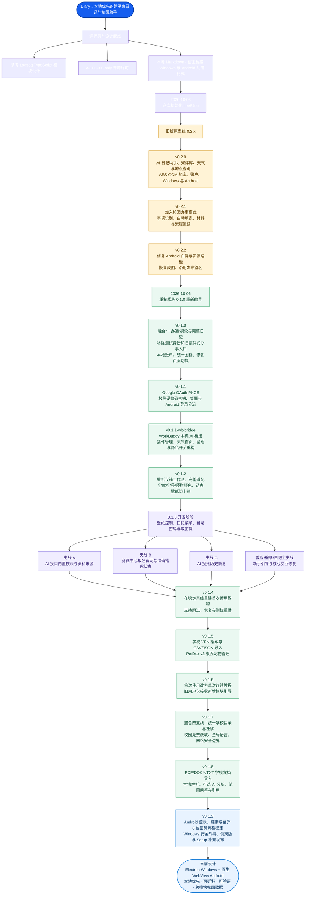

# Diary 重制版 0.1.9

## 设计与更新全历程

> 以下历程依据仓库远端提交、标签、开发分支和 GitHub Releases 整理（更新于 2026-10-09）。版本号较大的旧版 `0.2.x` 早于重制版 `0.1.x`；重制后版本从 `0.1.0` 重新开始。



### 历程说明与远端依据

- **设计根基**：本地优先 Markdown、宿主能力桥接和跨端兼容格式；部分 TypeScript 模块设计参考 Logseq，许可与来源见 [UPSTREAM.md](UPSTREAM.md) 和 [LICENSE.md](LICENSE.md)。
- **旧版原型线**：`v0.2.0 → v0.2.1 → v0.2.2` 验证了 AI、媒体、加密、账户、跨端和校园办事能力。
- **重制主线**：从 `v0.1.0` 重新编号，逐步完成一办通界面、登录、插件、壁纸、日记安全、新手教程、学校 VPN、桌宠、统一学校数据、校园竞赛、全局语言和学校文档问答。
- **支线集成**：AI 内置搜索、竞赛中心、搜索历史以及壁纸/日记/教程四个方向最终汇入重制主线；图中只按远端确有的提交与功能归纳，不把未发布实验当成正式版本。
- **当前版本**：`v0.1.9` 同时提供 Windows 便携版、Windows Setup 和 Android APK；下载及逐版本说明见 [GitHub Releases](https://github.com/twinightminer-arch/Diary/releases)，完整提交可在 [Commits](https://github.com/twinightminer-arch/Diary/commits) 与 [Branches](https://github.com/twinightminer-arch/Diary/branches) 核验。

## 桌面与 Android 应用

现已提供 Windows 桌面界面和 Android 原生 WebView 外壳。重制线采用“一办通”视觉体系统一首页、AI 问答、AI 搜索、竞赛中心、办事指南和完整日记功能；当前发布版本为 0.1.9。

日记模式继续支持新建、编辑、搜索、删除、Markdown 预览、单篇与批量加密、导入导出、五种语言和深浅主题。

## 功能特性

- **AI 日记助手**：设置里接入任意 OpenAI 兼容接口或 DeepSeek，可撰写草稿、润色、取标题、续写、生成插图；密钥由本机逐机密钥加密保存。
- **联网查询**：插入今天的日期、按经纬度查询天气、反查地点；页面本身 `connect-src 'none'`，联网一律由宿主完成。
- **媒体**：导入图片/动图/视频（插图与日记背景）和音频（背景音乐），支持动画头像；媒体库可预览、插入正文或删除。
- **逐篇与多篇加密**：侧栏多选后可一次性加密、解密或改密，密码需二次确认。
- **账户**：本地口令锁屏（仅作访问拦截，PBKDF2 310k），或 Google 登录（PKCE）；可修改用户名、头像与个性签名。

日记与媒体始终保存在本机，没有云同步和插件商店。

Windows 使用 `npm ci`、`npm run build`、`npm run dist:windows` 构建。若 `electron` 下载脚本未自动运行，先执行 `node node_modules/electron/install.js`。桌面入口为 `src/desktop/main.ts`，正式配置启用 Chromium sandbox、context isolation，并关闭 Node 集成与远程导航。

Android 使用系统 WebView、Java 和 Android SDK，无 Gradle 或第三方 Android 库依赖。准备 JDK 17+、Android SDK platform 35 和 build-tools 35，然后执行：

```powershell
./scripts/build-android.ps1 -Sdk C:\path\android-sdk -Keystore C:\private\diary-release.p12 -PasswordFile C:\private\password.txt
```

密码文件存放签名密钥密码。使用同一私钥签名后续更新，并递增 `AndroidManifest.xml` 的版本号。私钥及密码不是源码包的一部分。本次发布密钥保存在原工作区 `work/diary-signing/`，请私下备份，不要分享。

Windows 安装程序支持选择安装位置，创建桌面及开始菜单快捷方式；免安装 EXE 也会将数据保存在 `%APPDATA%\Diary\journals`。Android 将日记与媒体保存在应用私有目录，仅申请 `INTERNET` 权限供 AI 助手与天气/地点查询使用，不申请广泛存储权限；通过系统文件选择器导入导出。卸载 Android 应用会删除私有数据，请先导出备份。

使用 `npm test` 验证核心模块，`npm run check` 验证类型，`npm run test:desktop` 验证 Electron 界面。受限环境下可设置 `DIARY_BROWSER_TEST=1` 运行共享界面与真实文件系统的集成测试；这不等同于原生应用启动验证。

每个安装包内附 `Diary-source.zip`（Windows：应用 ASAR 中 `dist/web/`；Android：APK 中 `assets/`），输出目录同时提供独立源码 ZIP。源码包包含对应版本源代码、构建脚本、依赖锁文件和 AGPL 许可证；分享程序时请一并提供源码包。

Local-first Markdown diary foundation. Original TypeScript modules informed by the fetched Logseq source; see [UPSTREAM.md](UPSTREAM.md). Licensed AGPL-3.0-only; see [LICENSE.md](LICENSE.md).

```text
src/
  i18n/                   # Five complete UI dictionaries, locale switching
  plugins/
    skill-engine.ts       # Trusted module registration, capability grants, hooks
  agent/
    provider.ts           # Provider contract: chat and image generation
    connectors.ts         # OpenAI-compatible and DeepSeek connectors
    web.ts                # Date, weather, reverse geocode, search
    skills.ts             # Host meta-skills: agent, media, web, layout
  host/
    config.ts             # Settings; per-install device key seals API keys
    account.ts            # Local passcode gate; Google OAuth PKCE
    media.ts              # Import, list, read and remove diary media
    batch.ts              # Encrypt, decrypt and re-key many entries at once
  security/
    encryption.ts         # Web Crypto AES-256-GCM, PBKDF2 and batch transforms
  storage/
    markdown-engine.ts    # Flat frontmatter and local Markdown CRUD
```

Locale management, trusted skills, encryption, local storage, AI provider connectors, online lookups, media handling, account gating and batch encryption are all implemented in the host. The page never sees secrets or the filesystem: it reaches the host only through a single `call({ op })` bridge, and the desktop host verifies that every request comes from its own main frame.

## Usage

```ts
import { LocaleManager } from './src/i18n/index.ts';
import { SkillEngine } from './src/plugins/skill-engine.ts';

const i18n = new LocaleManager('zh-TW');
i18n.t('entrySaved', { title: '今日' });
i18n.setLocale('ja-JP');

const engine = new SkillEngine({
  'entries:create': async (input, signal) => {
    // Host adapter must validate input, restrict paths to the vault, then write .md.
    signal.throwIfAborted();
    return input;
  },
});
const unload = engine.load({
  definition: {
    id: 'diary.draft', description: 'Create a diary draft',
    instructions: 'Write a Markdown diary entry.', capabilities: ['entries:create'],
  },
  run: (input, ctx) => ctx.call('entries:create', input),
}, ['entries:create']); // Grants come from the host/user, never the skill itself.
await engine.execute('diary.draft', { markdown: '# Today\n' });
unload();
```

Hooks are trusted asynchronous observers; payloads/results are deliberately excluded. Hooks must terminate. Cancellation is cooperative; adapters and skills must honor the signal. Unloading blocks future capability calls, not already-running operations. This in-process loader accepts trusted pre-imported JS/compiled TS modules only. Arbitrary third-party code requires an isolated process and validated RPC; it can otherwise bypass the bus through ambient APIs. Skills must await capability calls. Host adapters own input validation, secret handling, delete confirmation and filesystem confinement.

Locale persistence and document `lang` updates belong to the UI adapter. Render translations as text, not HTML. Unknown locales fall back to English.

Run `npm test` on Node 24+. Run `npm install` then `npm run check` for strict TypeScript checking.

## 加密与本地存储

运行时无第三方依赖；文件管理使用 Node 内置模块，适用于 Node/Electron 主进程。加密模块使用 Web Crypto，也可用于浏览器安全上下文。

```ts
import { MarkdownEngine } from './src/storage/markdown-engine.ts';
import { encryptBatch } from './src/security/encryption.ts';

const diary = await MarkdownEngine.open('./vault');
await diary.createEntry('2026-09-30', {
  metadata: { title: '今日', tags: ['日常'] }, body: '# 今天\n记录生活。',
}, 'my-passcode');
await diary.updateEntry('2026-09-30', { body: '# 今天\n更新内容。' }, 'my-passcode');
const entry = await diary.readEntry('2026-09-30', 'my-passcode');
await diary.changeEntryPasscode('2026-09-30', 'my-passcode', 'new-passcode', 'new-passcode');
const summaries = await diary.listEntries(); // 不解密正文或 Frontmatter

const results = await encryptBatch([{ name: 'draft.md', content: '# 草稿' }], 'passcode', {
  concurrency: 2,
  onProgress: ({ completed, total }) => console.log(completed, total),
});
```

- AES-256-GCM，128 位认证标签，每次独立随机 16 字节盐与 12 字节 IV；PBKDF2-SHA256 使用 600,000 次迭代，密钥不可导出。版本、算法和派生参数参与认证。
- `verifyPasscode` 验证现有密文；`changePasscode` 和 `changeBatchPasscode` 先验证旧密码及新密码确认，再重新加密。错误密码与损坏密文返回统一错误。
- 批量函数只转换内存中的文件内容，不写磁盘；按输入顺序返回逐文件成功或失败结果。取消会跳过尚未开始的任务，正在执行的 Web Crypto 操作会完成。进度回调异常会在所有任务完成后汇总抛出。
- 文件写入先同步同目录临时文件，再原子替换；创建不会覆盖已有文件。批量操作不提供跨文件事务。未承诺断电后目录项持久性。
- 加密条目保持 `.md` 扩展名，内容为 `DIARY-ENC:1` 信封，并非可直接阅读的 Markdown。正文和 Frontmatter 一并加密，文件名仍可见。更新保持原加密状态；加密、解密和改密必须显式调用对应方法。
- 单个实例串行执行操作，文件夹须由宿主独占协调；不提供跨进程锁。拒绝目录穿越、Windows 保留名称及现有条目符号链接；这不能抵御有权限并发替换目录的本机进程。
- Frontmatter 仅支持扁平字符串、有限数值、布尔值、null 和 JSON 格式标量数组；不支持嵌套 YAML、锚点、多行块及行尾注释。正文逐字保留，保存时 Frontmatter 标准化。`updateEntry` 的 metadata 参数替换完整属性映射。
- Agent 宿主负责删除确认与能力授权；`deleteEntry` 为永久删除，加密条目删除前须验证密码。密码由调用方按次传入，存储引擎不缓存密码。
